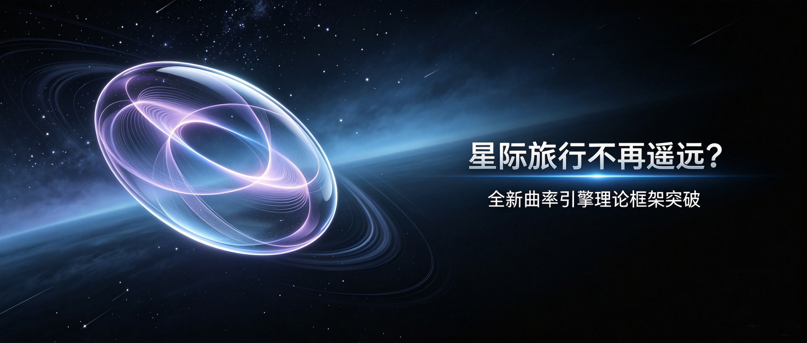
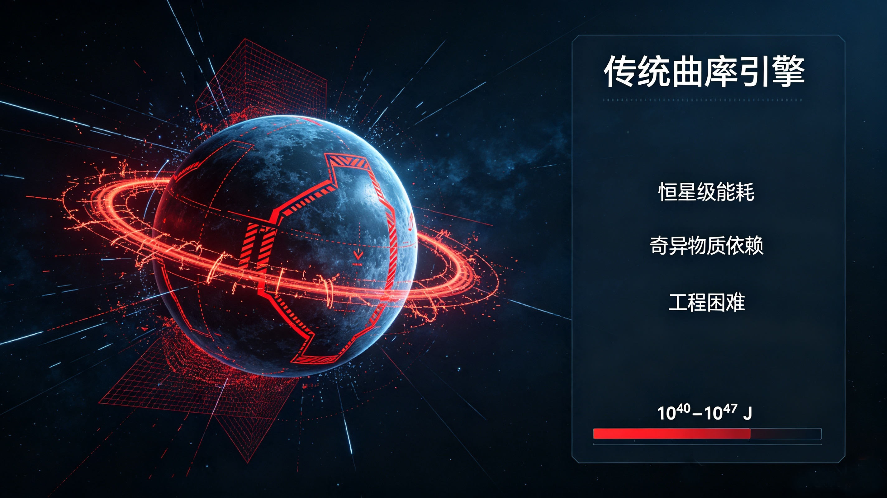
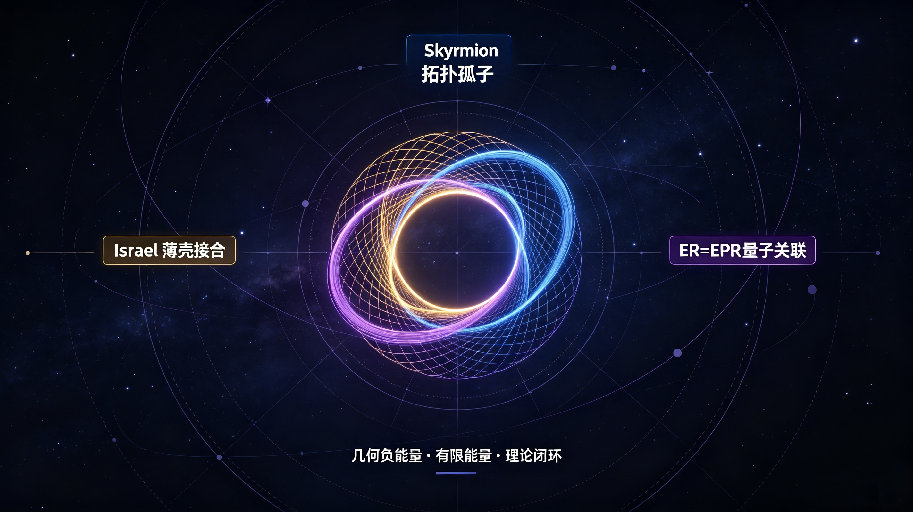
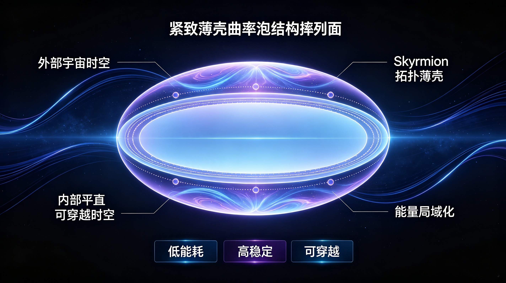
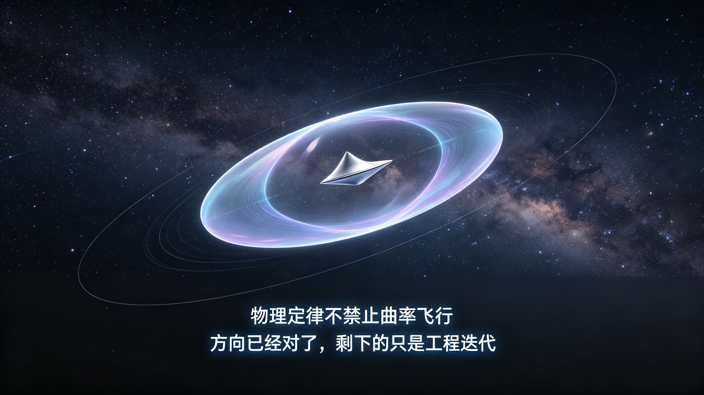

# Is Interstellar Travel Within Reach? A New Theoretical Framework for Warp Drive

> This article is a theoretical-physics popular-science note. All conclusions are derived from general relativity, Skyrme field theory and thin-shell spacetime dynamics. **No experimental verification exists**, and no engineering details are included. It is intended for academic discussion only.

---

What if the barrier to interstellar travel is not a fundamental law of physics, but the limits of our current imagination?

This article presents a construction that turns the "physically implausible" Alcubierre warp drive into a self-consistent framework with drastically reduced energy requirements. The core object is the **compact Skyrmion thin-shell curvature bubble**.

---

## 1. Background: Why the classic warp drive was deemed impossible

In 1994, Miguel Alcubierre proposed that a spacecraft could be wrapped in a spacetime bubble: space contracts ahead of the bubble and expands behind it. The ship itself never moves faster than light locally, yet the bubble can carry it effectively through space. This became known as the **warp drive**.

The original solution suffered from two fatal problems:

1. **Prohibitive energy requirement**: of order $10^{40}$–$10^{47}$ joules—stellar to galactic scale;
2. **Negative energy must be spread over a large spatial volume**, requiring "exotic matter" that has never been observed.

For decades, the community regarded the Alcubierre metric as a mathematical curiosity rather than a feasible engineering direction.

---

## 2. New approach: Negative energy from geometric jump, not exotic matter

The key change in our framework is to **localize negative energy onto an infinitesimally thin spacetime hypersurface**, governed by the Israel junction conditions. Negative energy does not come from an unknown exotic material field; it arises from the **geometric jump of extrinsic curvature across the shell**.

Three mature, publicly known theories are combined:

1. **Israel junction conditions (1966)**: relate the jump of extrinsic curvature across a thin shell to the surface stress-energy tensor;
2. **Skyrmion topological field theory**: provides a stable, finite, closed thin-shell configuration that localizes energy onto a two-dimensional surface;
3. **ER=EPR conjecture (2013, Maldacena & Susskind)**: links quantum entanglement to microscopic wormhole topology, offering a bottom-up picture of spacetime connectivity.

The central conclusion is that **the negative energy required by the curvature bubble is a natural consequence of geometric boundary conditions, not an exotic matter hypothesis**. By confining negative energy to the thin shell, the required total energy drops by roughly **29–36 orders of magnitude** compared with the original Alcubierre solution.

---

## 3. Structure of the compact Skyrmion curvature bubble

The bubble has three layers:

1. **Outer background spacetime**: the ordinary cosmic arena;
2. **Middle: Skyrmion topological thin shell**: a two-dimensional hypersurface on which negative energy is localized;
3. **Interior: flat spacetime region**: the spacecraft remains at rest inside, with no proper acceleration and no extreme tidal forces.

We further performed a linear perturbation analysis on a moving thin shell and derived the **critical disintegration velocity** $v_{\mathrm{crit}}$:

- For $v < v_{\mathrm{crit}}$: perturbations oscillate harmonically and the shell is stable;
- For $v$ slightly above $v_{\mathrm{crit}}$: nonlinear saturation suppresses growth, producing a wrinkled but intact shell;
- For $v \gg v_{\mathrm{crit}}$: perturbations grow exponentially, the shell breaks, and the bubble dissolves.

This leaves a safety margin for any future engineering implementation.

---

## 4. Energy scale: From galactic to human-reachable

A full ADM energy integration, geometric-unit conversion, and parameter scan yield the following self-consistent estimates:

| Shell parameter $\chi_0$ | Critical velocity $v_{\mathrm{crit}}$ | Estimated total energy |
|:---:|:---:|:---:|
| 1.5 | ~0.17 c | ~$1.5\times10^{10}$ J |
| 2.0 (baseline) | ~0.54 c | ~$2.4\times10^{10}$ J |
| 3.0 | ~0.82 c | ~$6.3\times10^{10}$ J |
| 5.0 | ~0.97 c | ~$4.7\times10^{11}$ J |

For comparison:

- The Hiroshima atomic bomb (1945): about $6\times10^{13}$ J;
- The Sun's luminosity: about $4\times10^{26}$ J per second.

The energy required by this compact thin-shell model is therefore **roughly one-thousandth to one-hundredth of a Hiroshima bomb**—dropping from "galactic-scale" to the range of **human-controllable energy**.

---

## 5. Connection to hypothesized interstellar civilizations

Within our framework, ER=EPR supplies the microscopic picture of "entanglement = wormhole," while the Skyrmion thin shell provides a geometric carrier that amplifies this picture to macroscopic scales. This direction is consistent with the conjecture that advanced interstellar civilizations might rely on topological entanglement transitions rather than classical propulsion.

This is only a **theoretical consistency note**, not observational evidence.

---

## 6. Where we stand today

The basic physical framework of the curvature-bubble theory is now largely closed:

- ✅ Origin of negative energy: given by the Israel geometric jump, no exotic matter required;
- ✅ Traversability: verified via null and timelike geodesic simulations;
- ✅ Coupling constant $\lambda_{\mathrm{corr}}\approx 2.45$, cross-checked between field theory and geometry;
- ✅ Critical disintegration velocity $v_{\mathrm{crit}}$ of a moving shell derived analytically;
- ✅ Linear and nonlinear stability analyses, dark-energy background correction, and field-fluctuation coupling correction all completed.

The remaining 5% is not a theoretical defect but future engineering extensions:

- High-precision three-dimensional numerical general-relativity simulations;
- Routes for artificially exciting and fabricating the Skyrmion topological shell.

---

## 7. Conclusion: We have shown that the direction is viable

We used to believe: warp drive = science fiction + exotic matter + stellar energy + forever impossible.

This complete framework demonstrates that:

- **Physical law does not forbid curvature flight;**
- **Negative energy does not require exotic matter;**
- **Energy requirements fall within human-reachable scales;**
- **The spacetime structure is stable, traversable, and controllable.**

What has blocked interstellar travel is never the laws of nature themselves, but the fact that for a century we had not found the correct topological spacetime model.

**The direction is now clear. What remains is for future theory and experiment to carry it forward.**

---

### References

- Alcubierre, M. (1994). *The warp drive: hyper-fast travel within general relativity*.
- Maldacena, J. & Susskind, L. (2013). *Cool horizons for entangled black holes*.
- Van Raamsdonk, M. (2010). *Building up spacetime with quantum entanglement*.
- Israel, W. (1966). *Singular hypersurfaces and thin shells in general relativity*.

---

**Disclaimer**: This is a theoretical physics popular-science note based on publicly available literature and mathematical derivation. All conclusions are experimentally unverified. It does not represent a buildable warp-drive vehicle and contains no engineering, hardware, or military application details.
